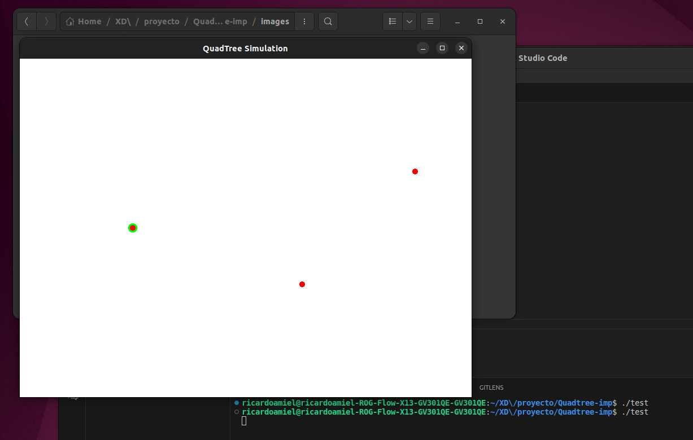
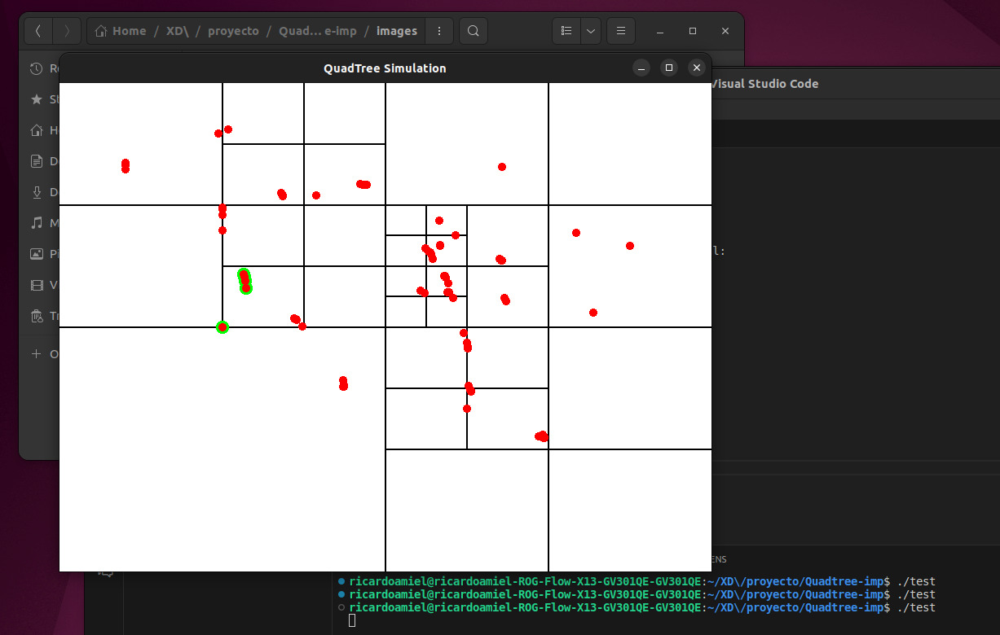
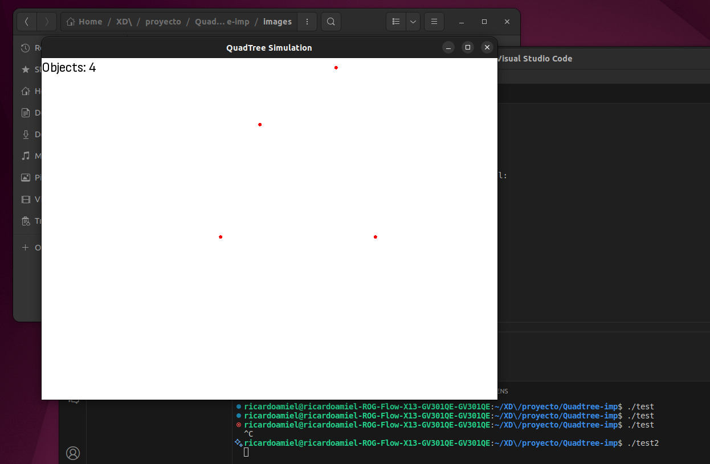
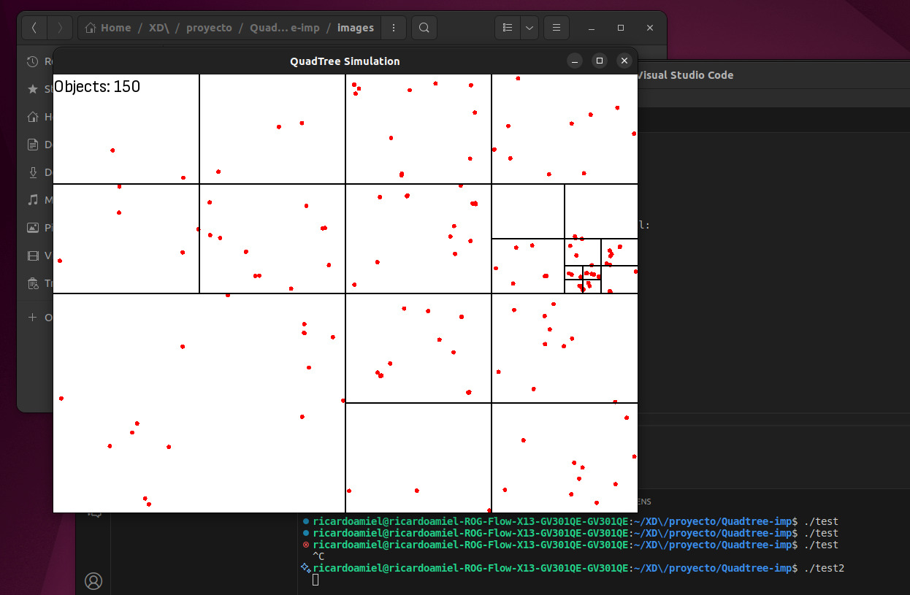

# Quadtree-imp
A quadtree simulation using sfml graphics

# HOW TO USE

run makefile using this command on your terminal:

## For run first test, 

make test
./test

### First screen

### When you hold the left click => create static points

## For run second test

make test2
./test2

### When you hold the left click => create random move points

## For delete 

rm test
rm test2

# WEBS REFERENCES

- [https://people.scs.carleton.ca/~maheshwa/courses/5703COMP/16Fall/quadtrees-paper.pdf]

- [https://www.youtube.com/watch?v=OJxEcs0w_kE]

- [https://www.youtube.com/watch?v=QQx_NmCIuCY]

- [https://www.youtube.com/watch?v=z0YFFg_nBjw]