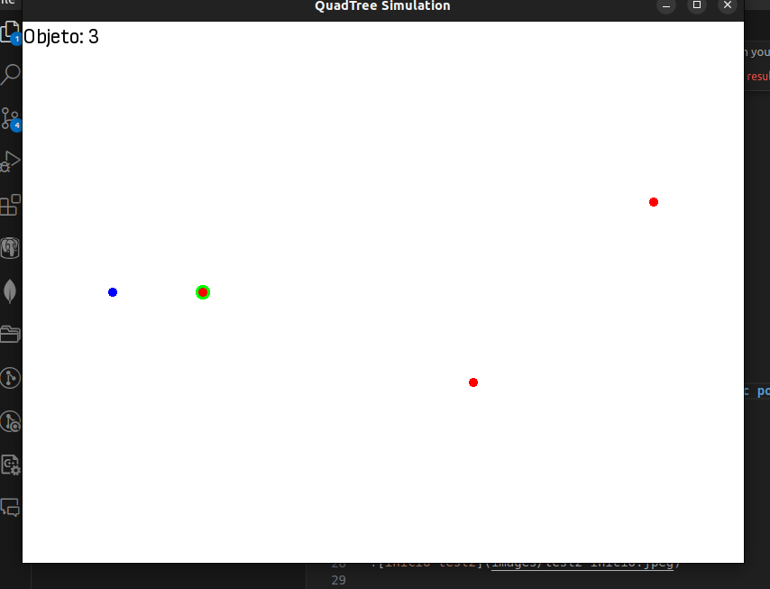
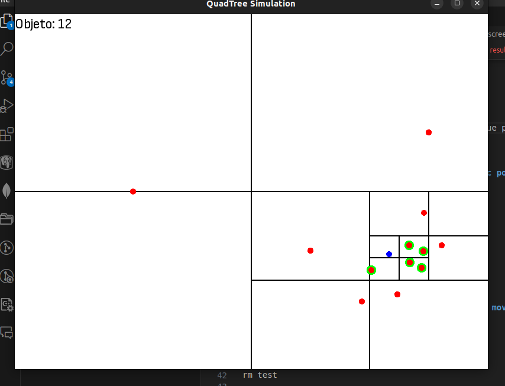
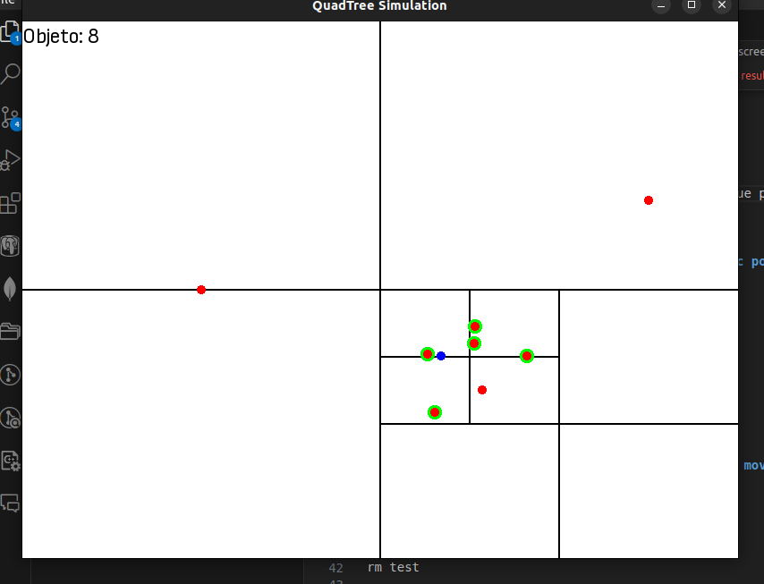
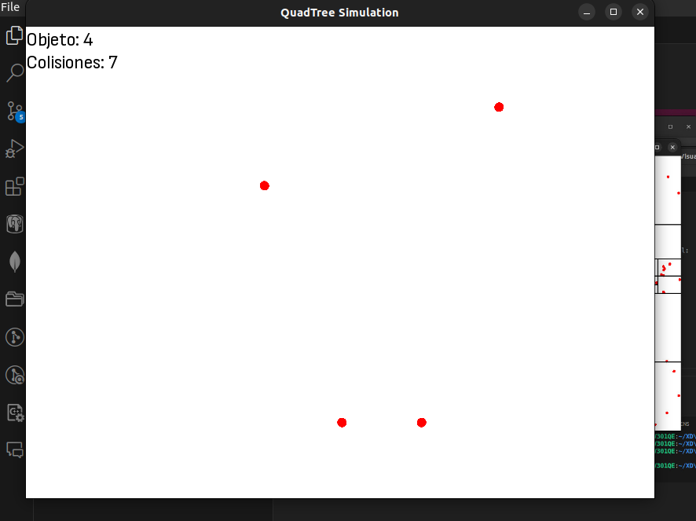
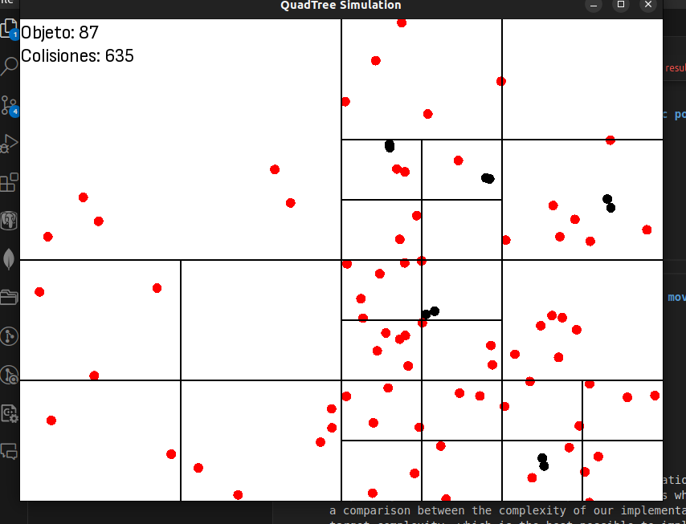
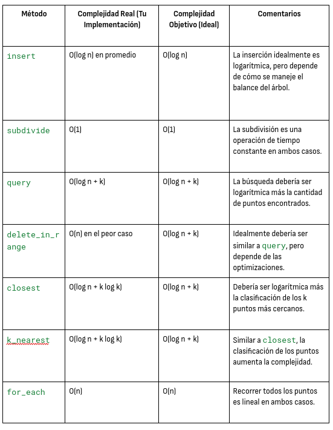
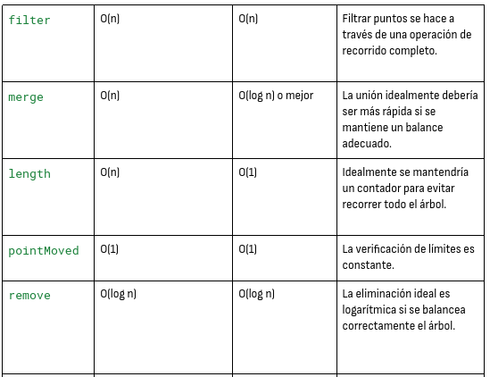

# Quadtree-imp
A quadtree simulation using sfml graphics

# HOW TO USE

run makefile using this command on your terminal:

## For run first test, 

make test

./test

### First screen 

We have an objects (points) counter at the upper left of the screen.

- Red points: Points in a node of the QuadTree.

- Blue point: Search range point.

- Red with green: Nearest points in a range of blue point.

### When you CLICK the left click => create static points

When you pass the node points capacity, subdivide nodes.

### When you CLICK the right click => remove static points

When you return of the range node points capacity, merge nodes.

## For run second test

make test2

./test2

### FIRST SCREEN

We have an objects (points) counter and accumulate colision counter at the upper left of the screen.

- Red points: Points in a node of the QuadTree.

- Gray points: Colission points turn red to gray for 16 frames.

### When you hold the left click => create random move points

## For delete 

rm test

rm test2

## COMPLEXITY TABLE

It is important to be able to compare what computational and spatial complexity our data structure encompasses. That is why we have made a comparison between the complexity of our implementation and the target complexity, which is the best possible to implement.

# WEBS REFERENCES

- [https://people.scs.carleton.ca/~maheshwa/courses/5703COMP/16Fall/quadtrees-paper.pdf]

- [https://www.youtube.com/watch?v=OJxEcs0w_kE]

- [https://www.youtube.com/watch?v=QQx_NmCIuCY]

- [https://www.youtube.com/watch?v=z0YFFg_nBjw]